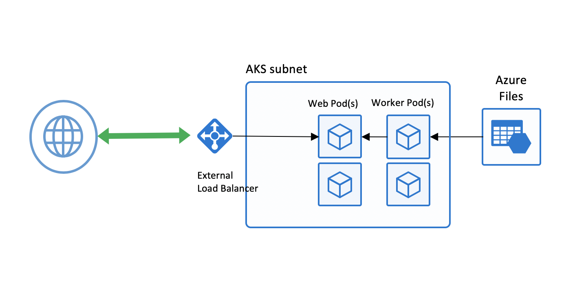
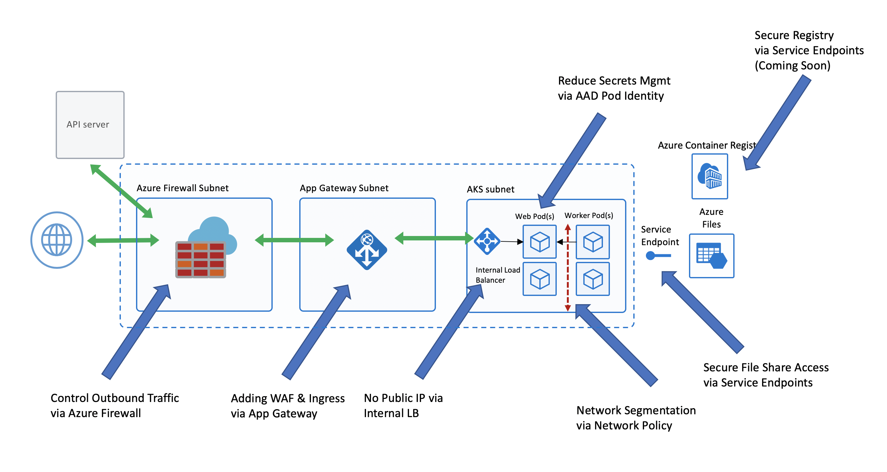
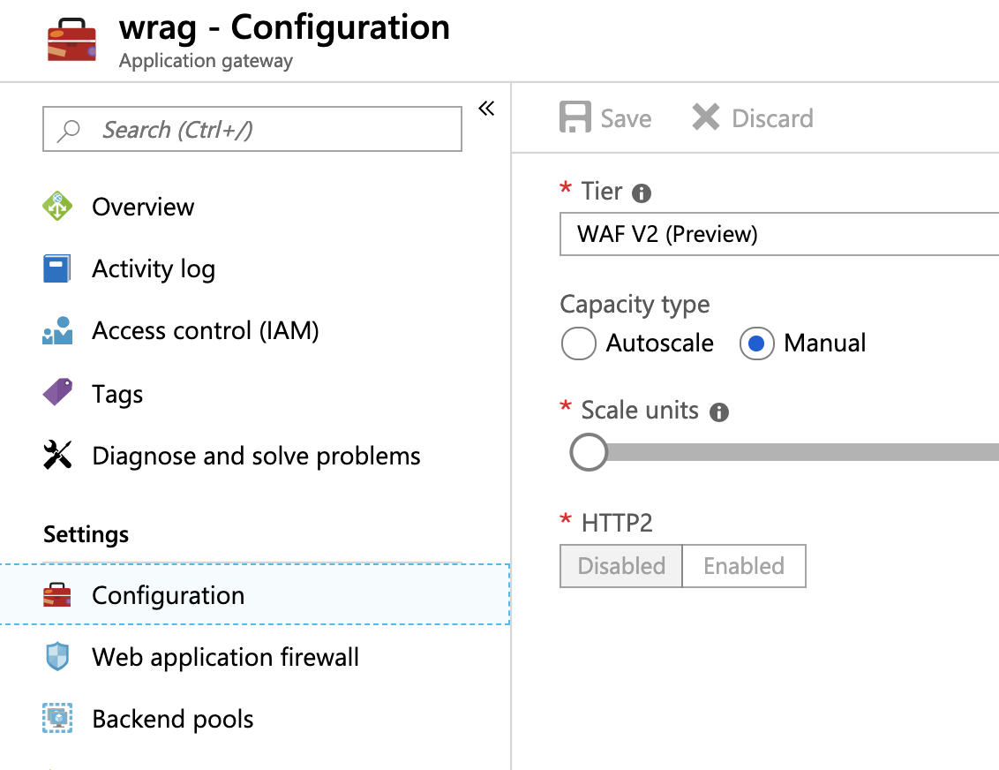

# Introduction

This was the security, networking and storage demo that was done as part of the AKS Best Practices session at Winter Ready. Apologies it took so long to get out of my head and into shareable content.

This repository walks you through the process of securing an AKS cluster. It will walk you through networking decisions, firewall setup, WAF setup and using Pod Managed Identities to reduce secrets management. Now let's get started.

## Architecture

Here is a before and after architecture picture of what we are going to be walking through. As you can see from the first diagram, it is an out of the box AKS setup which works for some organizations, but typically not those in a highly regulated environment.



However, the second diagram usually makes folks more comfortable as it has the subnets, a firewall, a WAF and service segmentation that organizations are looking for.



## Variable Setup

The variables are pretty straight forward, but please note there are a few words of caution on some of them.

```bash
PREFIX="wr"
RG="${PREFIX}-rg"
LOC="eastus"
NAME="${PREFIX}20190212"
ACR_NAME="${NAME}acr"
VNET_NAME="${PREFIX}vnet"
AKSSUBNET_NAME="${PREFIX}akssubnet"
SVCSUBNET_NAME="${PREFIX}svcsubnet"
ACISUBNET_NAME="${PREFIX}acisubnet"
# DO NOT CHANGE FWSUBNET_NAME - This is currently a requirement for Azure Firewall.
FWSUBNET_NAME="AzureFirewallSubnet"
APPGWSUBNET_NAME="${PREFIX}appgwsubnet"
WORKSPACENAME="${PREFIX}k8slogs"
IDENTITY_NAME="${PREFIX}identity"
FWNAME="${PREFIX}fw"
FWPUBLICIP_NAME="${PREFIX}fwpublicip"
FWIPCONFIG_NAME="${PREFIX}fwconfig"
FWROUTE_TABLE_NAME="${PREFIX}fwrt"
FWROUTE_NAME="${PREFIX}fwrn"
AGNAME="${PREFIX}ag"
AGPUBLICIP_NAME="${PREFIX}agpublicip"
```

## Create Resource Group

This section leverages the variables from above and creates the initial Resoruce Group where all of this will be deployed.

**For the SUBID (Azure Subscription ID), be sure to update your Subscription Name. If you do not know it, feel free to copy and paste your ID directly in. We will need the SUBID variable when working with Azure Resource IDs later in the walkthrough.**

```bash
# Get ARM Access Token and Subscription ID - This will be used for AuthN later.
ACCESS_TOKEN=$(az account get-access-token -o tsv --query 'accessToken')
# NOTE: Update Subscription Name
SUBID=$(az account show -s '<SUBSCRIPTION_NAME_GOES_HERE>' -o tsv --query 'id')
# Create Resource Group
az group create --name $RG --location $LOC
```

## AKS Creation VNET Pre-requisites

This section walks through the Virtual Network (VNET) setup pre-requisites before actually creating the AKS Cluster. One caveat on the subnet sizing below. All subnets were selected as /24 because it made things simple, but that is not a requirement. Please work with your networking teams to size the subnets appropriately for your organizations needs.

Here is a brief description of each of the dedicated subnets leveraging the variables populated from above:

* AKSSUBNET_NAME - This is where the AKS Cluster will get deployed.
* SVCSUBNET_NAME - This is the subnet that will be used for **Kubernetes Services** that are exposed via an Internal Load Balancer (ILB). By doing it this way we do not take away from the existing IP Address space in the AKS subnet that is used for Nodes and Pods.
* ACISUBNET_NAME - Although not part of this particular setup, this is for setting up Private Virtual Nodes and allowing Azure Container Instance (ACI) to be part of the same VNET. If you are interested in how to get this setup please reach out.
* FWSUBNET_NAME - This subnet is dedicated to Azure Firewall. **NOTE: The name cannot be changed at this time.**
* APPGWSUBNET_NAME - This subnet is dedicated to Azure Application Gateway v2 which will serve a dual purpose. It will be used as a Web Application Firewall (WAF) as well as an Ingress Controller. **NOTE: Azure App Gateway v2 is in preview at this time.**

```bash
# Create Virtual Network & Subnets for AKS, k8s Services, ACI, Firewall and WAF
az network vnet create \
    --resource-group $RG \
    --name $VNET_NAME \
    --address-prefixes 10.42.0.0/16 \
    --subnet-name $AKSSUBNET_NAME \
    --subnet-prefix 10.42.1.0/24
az network vnet subnet create \
    --resource-group $RG \
    --vnet-name $VNET_NAME \
    --name $SVCSUBNET_NAME \
    --address-prefix 10.42.2.0/24
az network vnet subnet create \
    --resource-group $RG \
    --vnet-name $VNET_NAME \
    --name $ACISUBNET_NAME \
    --address-prefix 10.42.3.0/24
az network vnet subnet create \
    --resource-group $RG \
    --vnet-name $VNET_NAME \
    --name $FWSUBNET_NAME \
    --address-prefix 10.42.4.0/24
az network vnet subnet create \
    --resource-group $RG \
    --vnet-name $VNET_NAME \
    --name $APPGWSUBNET_NAME \
    --address-prefix 10.42.5.0/24
```

## AKS Creation Azure Firewall Pre-requisites

This section walks through setting up Azure Firewall inbound and outbound rules. The main purpose of the firewall here is to help organizations to setup ingress and egress traffic rules so the AKS Cluster is not just open to the world and cannot reach out to everythign on the Internet at the same time.

**NOTE: Completely locking down inbound and outboudn rules for AKS is not supported and will result in a broken cluster.**

**NOTE: There are no inbound rules required for AKS to run. The only time an inbound rule is required is to expose a workload/service.**

It starts with creating a Public IP address and then gets into creating the Azure Firewall along with all of the Network (think ports and protocols) and Application (think egress traffic based on FQDNs) rules. If you want to lock down destination IP Addresses on some of the firewall rules you will have to use the destination IP Addresses for the datacenter region you are deploying into due to how AKS communicates with the managed control plane. The list of IP Addresses per region in XML format can be found and downloaded by clicking [here](https://www.microsoft.com/en-us/download/details.aspx?id=56519).

**NOTE: Azure Firewall, like other Network Virtual Appliances (NVAs), can be costly so please take note of that when deploying and if you intend to leave everythign running.**

```bash
# Create Public IP for Azure Firewall
az network public-ip create -g $RG -n $FWPUBLICIP_NAME -l $LOC --sku "Standard"
# Create Azure Firewall
az network firewall create -g $RG -n $FWNAME -l $LOC
# Configure Azure Firewall IP Config - This command will take several mins so be patient.
az network firewall ip-config create -g $RG -f $FWNAME -n $FWIPCONFIG_NAME --public-ip-address $FWPUBLICIP_NAME --vnet-name $VNET_NAME
# Capture Azure Firewall IP Address for Later Use
FWPUBLIC_IP=$(az network public-ip show -g $RG -n $FWPUBLICIP_NAME --query "ipAddress" -o tsv)
FWPRIVATE_IP=$(az network firewall show -g $RG -n $FWNAME --query "ipConfigurations[0].privateIpAddress" -o tsv)
# Validate Azure Firewall IP Address Values - This is more for awareness so you can help connect the networking dots
echo $FWPUBLIC_IP
echo $FWPRIVATE_IP
# Create UDR & Routing Table for Azure Firewall
az network route-table create -g $RG --name $FWROUTE_TABLE_NAME
az network route-table route create -g $RG --name $FWROUTE_NAME --route-table-name $FWROUTE_TABLE_NAME --address-prefix 0.0.0.0/0 --next-hop-type VirtualAppliance --next-hop-ip-address $FWPRIVATE_IP --subscription $SUBID
# Add Network FW Rules
# TCP - * - * - 22
# TCP - * - * - 443
# If you want to lock down destination IP Addresses you will have to use the destination IP Addresses for the datacenter region you are deploying into, see note from above.
# For Example: East US DC Destination IP Addresses: 13.68.128.0/17,13.72.64.0/18,13.82.0.0/16,13.90.0.0/16,13.92.0.0/16,20.38.98.0/24,20.39.32.0/19,20.42.0.0/17,20.185.0.0/16,20.190.130.0/24,23.96.0.0/17,23.98.45.0/24,23.100.16.0/20,23.101.128.0/20,40.64.0.0/16,40.71.0.0/16,40.76.0.0/16,40.78.219.0/24,40.78.224.0/21,40.79.152.0/21,40.80.144.0/21,40.82.24.0/22,40.82.60.0/22,40.85.160.0/19,40.87.0.0/17,40.87.164.0/22,40.88.0.0/16,40.90.130.96/28,40.90.131.224/27,40.90.136.16/28,40.90.136.32/27,40.90.137.96/27,40.90.139.224/27,40.90.143.0/27,40.90.146.64/26,40.90.147.0/27,40.90.148.64/27,40.90.150.32/27,40.90.224.0/19,40.91.4.0/22,40.112.48.0/20,40.114.0.0/17,40.117.32.0/19,40.117.64.0/18,40.117.128.0/17,40.121.0.0/16,40.126.2.0/24,52.108.16.0/21,52.109.12.0/22,52.114.132.0/22,52.125.132.0/22,52.136.64.0/18,52.142.0.0/18,52.143.207.0/24,52.146.0.0/17,52.147.192.0/18,52.149.128.0/17,52.150.0.0/17,52.151.128.0/17,52.152.128.0/17,52.154.64.0/18,52.159.96.0/19,52.168.0.0/16,52.170.0.0/16,52.179.0.0/17,52.186.0.0/16,52.188.0.0/16,52.190.0.0/17,52.191.0.0/18,52.191.64.0/19,52.191.96.0/21,52.191.104.0/27,52.191.105.0/24,52.191.106.0/24,52.191.112.0/20,52.191.192.0/18,52.224.0.0/16,52.226.0.0/16,52.232.146.0/24,52.234.128.0/17,52.239.152.0/22,52.239.168.0/22,52.239.207.192/26,52.239.214.0/23,52.239.220.0/23,52.239.246.0/23,52.239.252.0/24,52.240.0.0/17,52.245.8.0/22,52.245.104.0/22,52.249.128.0/17,52.253.160.0/24,52.255.128.0/17,65.54.19.128/27,104.41.128.0/19,104.44.91.32/27,104.44.94.16/28,104.44.95.160/27,104.44.95.240/28,104.45.128.0/18,104.45.192.0/20,104.211.0.0/18,137.116.112.0/20,137.117.32.0/19,137.117.64.0/18,137.135.64.0/18,138.91.96.0/19,157.56.176.0/21,168.61.32.0/20,168.61.48.0/21,168.62.32.0/19,168.62.160.0/19,191.233.16.0/21,191.234.32.0/19,191.236.0.0/18,191.237.0.0/17,191.238.0.0/18
# Add the Azure Firewall extension to Azure CLI in case you do not already have it.
az extension add --name azure-firewall
# Create the Outbound Network Rule from Worker Nodes to Control Plane
az network firewall network-rule create -g $RG -f $FWNAME --collection-name 'aksfwnr' -n 'ssh' --protocols 'TCP' --source-addresses '*' --destination-addresses '*' --destination-ports 22 443 --action allow --priority 100
# Add Application FW Rules for Egress Traffic
az network firewall application-rule create -g $RG -f $FWNAME --collection-name 'aksfwar' -n 'AKS' --source-addresses '*' --protocols 'http=80' 'https=443' --target-fqdns 'k8s.gcr.io' 'storage.googleapis.com' '*eastus.azmk8s.io' '*auth.docker.io' '*cloudflare.docker.io' '*registry-1.docker.io' '*.ubuntu.com' '*azurecr.io' '*blob.core.windows.net' '*mcr.microsoft.com' '*cdn.mscr.io' --action allow --priority 100
# Associate AKS Subnet to Azure Firewall
az network vnet subnet update -g $RG --vnet-name $VNET_NAME --name $AKSSUBNET_NAME --route-table $FWROUTE_TABLE_NAME
# OR if you know the Subnet ID and would prefer to do it that way.
#az network vnet subnet show -g $RG --vnet-name $VNET_NAME --name $AKSSUBNET_NAME --query id -o tsv
#SUBNETID=$(az network vnet subnet show -g $RG --vnet-name $VNET_NAME --name $AKSSUBNET_NAME --query id -o tsv)
#az network vnet subnet update -g $RG --route-table $FWROUTE_TABLE_NAME --ids $SUBNETID
```

## AKS Creation Service Principal Pre-requisites

This section walks through creatiing a Service Principal which will be used by AKS to create the cluster resources. It is this Service Principal that actually creates the underlying Azure Resources such as VMs, Storage, Load Balancers, etc. used by AKS. If you grant to few permissions it will not be able to create the AKS Cluster. If you grant too much then the Security Prinicple of Least Privilege is not being followed. If you have an existing Service Principal feel free to leverage that.

The key permission that is being granted to the Service Princiapl below is to the Virtual Network so it can create resources inside of the network.

```bash
# Create SP and Assign Permission to Virtual Network
az ad sp create-for-rbac -n "${PREFIX}sp" --skip-assignment
# Take the SP Creation output from above command and fill in Variables accordingly
APPID="<SERVICE_PRINCIPAL_APPID_GOES_HERE>"
PASSWORD="<SERVICEPRINCIPAL_PASSWORD_GOES_HERE>"
VNETID=$(az network vnet show -g $RG --name $VNET_NAME --query id -o tsv)
# Assign SP Permission to VNET
az role assignment create --assignee $APPID --scope $VNETID --role Contributor
```

## AKS Creation Azure Monitor for Containers Pre-requisites

All that is being done in this section is to setup a Log Analytics Workspace for AKS to help with monitoring, logging and troubleshooting down the road. If you create one ahead of time you get to control the name of the workspace and where it goes.

You also have the option of using an existing Log Analytics workspace or you can have AKS create one automatically for you. For the purposes of this walkthrough we are going to focus on creating one ahead of time so we have control over its lifecycle independent of the AKS Cluster.

```bash
# Create Log Analytics Workspace
az group deployment create -n $WORKSPACENAME -g $RG \
  --template-file azuredeploy-loganalytics.json \
  --parameters workspaceName=$WORKSPACENAME \
  --parameters location=$LOC \
  --parameters sku="Standalone"
# Set Workspace ID
WORKSPACEIDURL=$(az group deployment list -g $RG -o tsv --query '[].properties.outputResources[0].id')
```

## AKS Cluster Creation

Yay! We are at the point where all of the pre-requisite decisions have been made and setup. We can now provision AKS.

``` bash
# Version Info - This is here so you can check out which AKS versions are available in the target region
az aks get-versions -l $LOC -o table
# Populate the AKS Subnet ID - This is needed so we know which subnet to put AKS into
SUBNETID=$(az network vnet subnet show -g $RG --vnet-name $VNET_NAME --name $AKSSUBNET_NAME --query id -o tsv)
# Create AKS Cluster with Monitoring add-on using Service Principal from Above
az aks create -g $RG -n $NAME -k 1.12.6 -l $LOC \
  --node-count 2 --generate-ssh-keys \
  --enable-addons monitoring \
  --workspace-resource-id $WORKSPACEIDURL \
  --network-plugin azure \
  --network-policy azure \
  --service-cidr 10.41.0.0/16 \
  --dns-service-ip 10.41.0.10 \
  --docker-bridge-address 172.17.0.1/16 \
  --vnet-subnet-id $SUBNETID \
  --service-principal $APPID \
  --client-secret $PASSWORD \
  --no-wait
```

## Get AKS Cluster Credentials

You will have to wait a few moments for the AKS Cluster to finish provisioning after the command above completes. The first command below will help you check the current state in terms of running or completed.

Once the AKS cluster has finished provisioning you can run the get-credentials sub command to get the corresponding kubeconfig, and then get nodes to make sure everythign is working.

**NOTE: From here on in you will see the letter 'k' being used in all scripts, this is an alias for 'kubectl' because I am a lazy.**

```bash
# Check Provisioning Status of AKS Cluster - ProvisioningState should say 'Succeeded'
az aks list -o table
# Get AKS Credentials so kubectl works
az aks get-credentials -g $RG -n $NAME --admin
# Setup alias to kubectl becuase I am lazy
alias k="kubectl"
# Get Nodes
k get nodes -o wide
```

## Check Egress Traffic through Firewall

This section is a simple test to validate the subnet setup is correct and egress traffic is flowing through the Azure Firewall.

**Note: If the curl commands below fail, double-check the Azure Firewall rules were setup correctly and the AKS subnet is being protected by Azure Firewall.**

```bash
# Test Azure Firewall
cat <<EOF | k apply -f -
apiVersion: v1
kind: Pod
metadata:
  name: centos
spec:
  containers:
  - name: centoss
    image: centos
    ports:
    - containerPort: 80
    command:
    - sleep
    - "3600"
EOF
# Exec into Pod and Check Traffic
k get po -o wide
k exec -it centos -- /bin/bash
# This curl command should work
curl www.ubuntu.com
# This curl command should fail showing that not even Superman can get through Azure Firewall
curl superman.com
exit
```

## Create Azure App Gateway v2

This section is pretty straight forward in that we are creating an instance of Azure Application Gateway v2, which is in preview, and injecting it into a dedicated subnet in our VNET. All inbound traffic will be routed through the Azure Application Gateway v2 instance which is protecting traffic using its WAF capabilities while acting as a kubernetes Ingress Controller at the same time.

**NOTE: The Private IP Address below has to be from the subnet the Azure Application Gateway v2 is going into.**

**NOTE: Azure Application Gateway requires a Public IP address at this time (meaning cannot have Private IP only) in order for WAF v2 to work. As a result, this setup is not recommended for Production deployments at this time, it is simply used to demonstrate what is coming and how to leverage Pod Managed Identities to interact with Azure resources to reduce Secrets management. More coming on that below.**

```bash
# Create Azure App Gateway v2 with WAF and autoscale set to manual.
# NOTE: Azure App Gateway v2 is currently in Preview. Also note that it is not possible at this time
# to create an Azure App Gateway with WAF enabled without a Public IP.
# Create Public IP needed for Azure Application Gateway - This is needed due to WAF
az network public-ip create -g $RG -n $AGPUBLICIP_NAME -l $LOC --sku "Standard"
# Create App Gateway using WAF_v2 SKU - This will take several minutes so be patient.
az network application-gateway create \
  --name $AGNAME \
  --resource-group $RG \
  --location $LOC \
  --min-capacity 2 \
  --capacity 2 \
  --frontend-port 80 \
  --http-settings-cookie-based-affinity Disabled \
  --http-settings-port 80 \
  --http-settings-protocol Http \
  --routing-rule-type Basic \
  --sku WAF_v2 \
  --private-ip-address 10.42.5.12 \
  --public-ip-address $AGPUBLICIP_NAME \
  --subnet $APPGWSUBNET_NAME \
  --vnet-name $VNET_NAME
```

## *****Update Azure App Gateway v2 Config to be Manual*****

As already mentioned, Azure App Gateway v2 is currently in preview so there are still a few kinks to be worked out. One of those is setting the configuration to 'Manual' when using it as an Ingress Controller with AKS. You will need to go into the Portal and set it to 'Manual' under 'Configuration' blade:



## Azure Identity Creation

This section walks us through the pre-requisites needed to run Pod Managed Identities. Pod Managed Identities are nice as the lifecycle of the identity is managed by Azure AD and we can simply grant the identity the necessary permissions to interact with Azure Resources that is needed. In this particular case, we are going to grant the Azure Identity the necessary permissions to read and write rules in the Azure Application Gateway v2 instance created above. This is how the Ingress Rules that are created in kubernetes manifest themselves inside of Azure Application Gateway v2. The nice thing about using this type of setup is that I am not having to manage secrets and worrying about how to inject those inside of my Pod so it has the proper credentials to be able to interact with resoruces.

**NOTE: Make sure the Azure Identity is created in the same RG as the VMs.**

**NOTE: There are a large number of manual steps in this section where you will be updating kubernetes manifest files so please take note and follow those steps.**

```bash
# Deploy Azure AD Identity Stuff
k create -f https://raw.githubusercontent.com/Azure/aad-pod-identity/master/deploy/infra/deployment-rbac.yaml
# This command is only here if you need to delete the setup for troubleshooting purposes.
#k delete -f https://raw.githubusercontent.com/Azure/aad-pod-identity/master/deploy/infra/deployment-rbac.yaml
# Create User Identity
# **** Make sure it is in the same RG as the VMs. ****
IDENTITY=$(az identity create -g "MC_${RG}_${NAME}_${LOC}" -n $IDENTITY_NAME)
# Simply here so you are aware what it looks like.
echo $IDENTITY
# Assign Reader Role to Azure Identity on Resource Group
ROLEREADER=$(az role assignment create --role Reader --assignee $APPID --scope "/subscriptions/${SUBID}/resourcegroups/${RG}")
# Simply here so you are aware what it looks like.
echo $ROLEREADER
# Assign Managed Identity Operator to AKS Service Principal on Azure Identity. I know, try and wrap your head around that one. Simply, we are granting the AKS Service Principal the permissions to interact with the Managed Identity Controller (MIC) deployed from above in the context of the created Azure Identity. Meaning, only that Azure Identity and nothing else.
SCOPEID=$(echo $IDENTITY | jq .id | tr -d '"')
# Simply here so you are aware what it looks like.
echo $SCOPEID
ROLEMIC=$(az role assignment create --role "Managed Identity Operator" --assignee $APPID --scope $SCOPEID)
# Simply here so you are aware what it looks like.
echo $ROLEMIC
# Install User Azure AD Identity
# NOTE: Update the ResourceID and ClientID in aadpodidentity.yaml with id and clientId output of the $IDENTITY variable.
echo $IDENTITY | jq .id | tr -d '"'
echo $IDENTITY | jq .clientId | tr -d '"'
k apply -f aadpodidentity.yaml
# Only here if you want to delete the deployment.
#k delete -f aadpodidentity.yaml
# Install Pod to Identity Binding on k8s cluster
echo $IDENTITY | jq .name | tr -d '"'
k apply -f aadpodidentitybinding.yaml
# Only here if you want to delete the deployment.
#k delete -f aadpodidentitybinding.yaml
# Check out Sample Deployment Using AAD Pod Identity to ensure everything is working.
# NOTE: Update --subscriptionid --clientid and --resourcegroup in aadpodidentity-deployment.yaml accordingly.
echo $SUBID
echo $IDENTITY | jq .clientId | tr -d '"'
echo $RG
k apply -f aadpodidentity-deployment.yaml
# Only here if you want to delete the deployment.
#k delete -f aadpodidentity-deployment.yaml
# Take note of the aadpodidentitybinding label as this determines which binding is used.
k get po --show-labels -o wide
# Check logs to make sure there are no errors.
# Should see messages like 'succesfully made GET on instance metadata'
k logs $(kubectl get pod -l "app=demo" -o jsonpath='{.items[0].metadata.name}') | grep 'succesfully made GET on instance metadata'
k logs $(kubectl get pod -l "app=demo" -o jsonpath='{.items[0].metadata.name}')
```

## Setting up Azure Application Gateway v2 as AKS Ingress Controller

This section walks us through setting up the Azure Appliation Gateway v2 resource created above as a kubernetes Ingress Controller.

```bash
# Setup App Gateway Ingress
# Setup Helm First
kubectl create serviceaccount --namespace kube-system tiller-sa
kubectl create clusterrolebinding tiller-cluster-rule --clusterrole=cluster-admin --serviceaccount=kube-system:tiller-sa
helm init --tiller-namespace kube-system --service-account tiller-sa
helm repo add application-gateway-kubernetes-ingress https://azure.github.io/application-gateway-kubernetes-ingress/helm/
helm repo update
# Install and Setup Ingress
# Grant Azure Identity Access to App Gateway
ASSIGNEEID=$(echo $IDENTITY | jq .clientId | tr -d '"')
# Simply here so you are aware what it looks like.
echo $ASSIGNEEID
# This grabs the ID of our Azure Application Gateway v2 instance so we can use it as part of our scope declarations when assigning permissions between identities and roles.
APPGATEWAYSCOPEID=$(az network application-gateway show -g $RG -n $AGNAME | jq .id | tr -d '"')
# Simply here so you are aware what it looks like.
echo $APPGATEWAYSCOPEID
# Create Role Assignments for Azure Identity (aka Grant Permissions)
ROLEAGWCONTRIB=$(az role assignment create --role Contributor --assignee $ASSIGNEEID --scope $APPGATEWAYSCOPEID)
ROLEAGWREADER=$(az role assignment create --role Reader --assignee $ASSIGNEEID --scope "/subscriptions/${SUBID}/resourcegroups/${RG}")
# Appears to be a bug in the preview Ingress Controller whereby there is an explicit check for this permission which is why it is needed in addition to granting at Resource Group level.
ROLEAGWREADER2=$(az role assignment create --role Reader --assignee $ASSIGNEEID --scope $APPGATEWAYSCOPEID)
# Simply here so you are aware what it looks like.
echo $ROLEAGWCONTRIB
echo $ROLEAGWREADER
echo $ROLEAGWREADER2
# NOTE: Update subscriptionId, resourceGroup, name, identityResourceID, identityClientID and apiServerAddress in agw-helm-config.yaml file with the following.
echo $SUBID
echo $RG
echo $(az network application-gateway show -g $RG -n $AGNAME | jq .name | tr -d '"')
echo $IDENTITY | jq .id | tr -d '"'
echo $IDENTITY | jq .clientId | tr -d '"'
k cluster-info | grep 'Kubernetes master'
# eg. wr20190212-wr-rg-12345b-c9871ce7.hcp.eastus.azmk8s.io
# Using all the inputs from above, be sure to update the agw-helm-config.yaml before executing Helm command
helm install --name wragw -f agw-helm-config.yaml application-gateway-kubernetes-ingress/ingress-azure
# Check Created Resources
k get po,svc,ingress,deploy,secrets
helm list
# Only here if you want to delete the Helm deployment
#helm delete wragw --purge
```

## Deploy Workload

A little about this workload. As you can see from the original diagram at the top, there are two services.

The first service is a web front-end written in .NET Core that sets up a SignalR Hub for receiving real-time communication from the back-end worker node, which in turn realays that to the web client.

The second service is a tensorflow model that classifies pictures of fruit that are located in Azure Files. Each time an image has been classified it communicates back to the SignalR Hub setup on the web front-end which then relays that to the client.

This setup is different than your typical web to database communication as it flows the other way from back-end to front-end. Keep those communication paths in mind when we get to updating variables for communication between servics as well as service segmentation.

**NOTE: Kubernetes volume mounting is not Azure Identity aware yet so when mounting Azure Files we still need to use traditional credentials which means creating a kubernetes secret.**

**NOTE: Upload the images in the fruit directory of this repository into an Azure Storage Account that is setup with Azure Files and all those images are in a directory called 'fruit'. It is this directory that the back-end worker will use to analyze images.**

```bash
# Add Web Front-End
k apply -f winterready-web.yaml
# Add Ingress Rule which will be leveraged by Azure Identity to update a rule in Azure Application Gateway v2
k apply -f winterready-ingress-web.yaml
# Only here if you want to delete the deployments
#k delete -f winterready-web.yaml
#k delete -f winterready-ingress-web.yaml
# NOTE: Be sure you uploaded the images in the fruit directory into an Azure Storage Account that is setup with Azure Files and all those images are in a directory called 'fruit'.
# Update <STORAGE_ACCOUNT_NAME_GOES_HERE> and <STORAGE_ACCOUNT_KEY_GOES_HERE> below with the correct credentials from the Azure Storage account created above.
k create secret generic fruit-secret --from-literal=azurestorageaccountname=<STORAGE_ACCOUNT_NAME_GOES_HERE> --from-literal=azurestorageaccountkey=<STORAGE_ACCOUNT_KEY_GOES_HERE>
# Add Worker Back-End
# NOTE: Not needed if we use Storage Service Endpoints.
az network firewall network-rule create -g $RG -f $FWNAME --collection-name 'aksfwnr2' -n 'fileshare' --protocols 'TCP' --source-addresses '*' --destination-addresses '*' --destination-ports 445 --action allow --priority 200
# Add Worker Back-End
k apply -f winterready-worker.yaml
k get po,svc,ingress,deploy,secrets
# Only here if you want to delete the deployments
#k delete -f winterready-worker.yaml
```

## Check Workload

The moment we have been waiting for, seeing the workload in action with all of the security in place.

```bash
# Get Public IP of Azure Application Gateway
az network public-ip show -g $RG -n $AGPUBLICIP_NAME --query "ipAddress" -o tsv
# Now put that Public IP address in your browser and see the applcation in action.
```

## Last Piece, Service Segregation

This last section takes us through how to setup Service Segmentation inside of the AKS Cluster so that not just any service can talk to any other service. This is done via Network Policy.

**NOTE: The 10.42.2.232 IP Address below is the IP Address of the Internal Load Balancer (ILB) created above when Ingress was being setup. If you changed it, update the IP Address accordingly.**

```bash
# Network Policy Setup - This should return nothing to start.
k get networkpolicy
# Network Policy Testing
# This should work and return back html.
k exec -it centos -- curl 10.42.2.232
k apply -f np-denyall.yaml
# Now this should fail (timeout) as we laid down a blanket deny all ingress and egress traffic in the AKS Cluster
k exec -it centos -- curl 10.42.2.232
# Open up a new browser tab so that a new Web Socket (using SignalR) connection is established as existing web socket connections are already established and will continue to work.
# Apply network policy rules to allow incoming traffic from Ingress Controller as well as incoming traffic from the worker.
k apply -f np-web-allow-ingress.yaml
k apply -f np-web-allow-worker.yaml
# You should now see 3 Rules
k get networkpolicy
# This command should still fail as this IP Address is not in the allowed ingress network policy rules
k exec -it centos -- curl 10.42.2.232
# Check Public IP Address and Web Application should be working again.
# Only here if you want to delete the deployments
#k delete -f np-denyall.yaml
#k delete -f np-web-allow-worker.yaml
#k delete -f np-web-allow-ingress.yaml
```

## Cleanup

If you want to clean things up by removing your kukbeconfig settings and deleting the Resource Group.

```bash
# Cleanup
# Cleanup K8s Contexts
k config delete-context $NAME
k config delete-context "${NAME}-admin"
k config delete-cluster $NAME
k config unset "users.clusterUser_${RG}_${NAME}"
k config unset "users.clusterAdmin_${RG}_${NAME}"
k config view
# Delete RG
az group delete --name $RG --no-wait -y
```